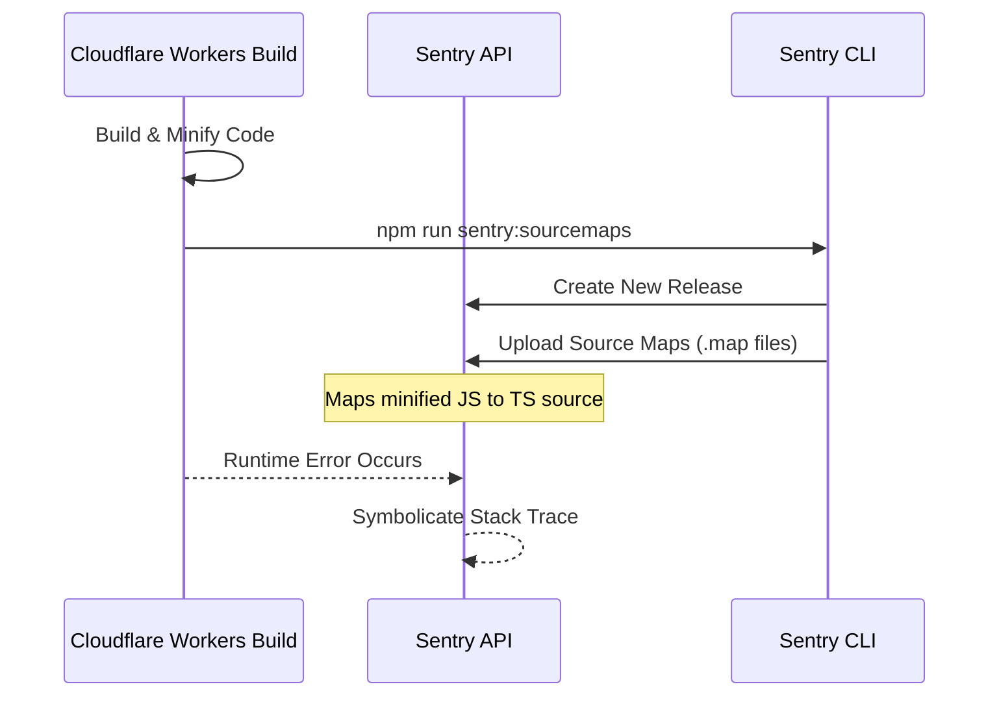
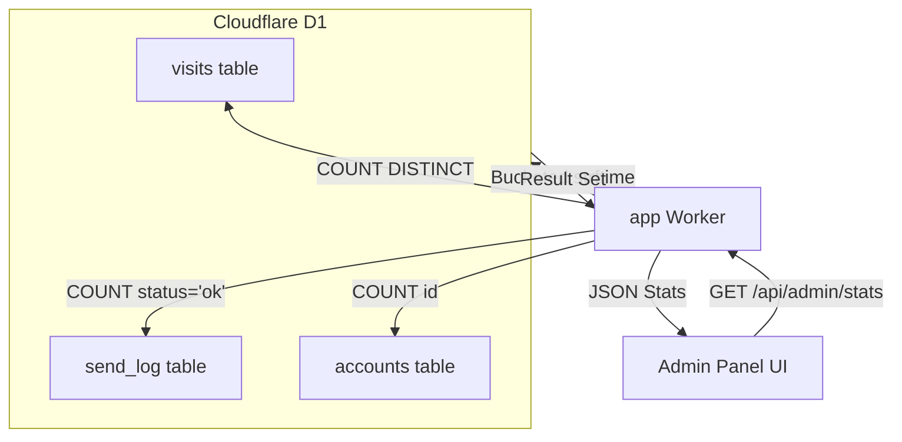

Relevant source files

The following files were used as context for generating this wiki page:

- [infra/healthcheck.py](infra/healthcheck.py)
- [infra/incident-claude-action-runaway.md](infra/incident-claude-action-runaway.md)
- [app/public/app.js](app/public/app.js)
- [campaign/src/index.ts](campaign/src/index.ts)
- [README.md](README.md)
- [app/src/admin-stats.ts](app/src/admin-stats.ts)
- [campaign/package.json](campaign/package.json)

# Monitoring, Healthchecks & Sentry

Monitoring in the `politiker-webapp` project is a multi-layered system designed to ensure the reliability of the Cloudflare Workers environment, the integrity of the contact database, and the stability of automated campaign tasks. It combines proactive health checks, real-time error tracking via Sentry, and automated client-side error reporting to GitHub.

The system is designed to operate independently of a central server where possible, utilizing local cron routines, cloud-based scheduled tasks, and external telemetry to maintain high availability.

Sources: [README.md:158-160](README.md#L158-L160), [infra/healthcheck.py:1-12](infra/healthcheck.py#L1-L12)

## Sentry Error Tracking

All three primary Workers—`app`, `sender`, and `campaign`—are integrated with Sentry using the `@sentry/cloudflare` SDK. This provides deep visibility into runtime exceptions and performance metrics across the distributed architecture.

### Implementation and Configuration
The project wraps Worker exports with `Sentry.withSentry()`. This allows Sentry to capture unhandled exceptions and monitor scheduled events. In the `campaign` Worker, for instance, Sentry is used to capture exceptions within asynchronous tasks initiated by `ctx.waitUntil`.

Sources: [campaign/src/index.ts:38-44](campaign/src/index.ts#L38-L44), [README.md:129-131](README.md#L129-L131)

### Source Map Integration
To ensure stack traces are readable (displaying TypeScript code instead of minified JavaScript), the project employs a `postdeploy` hook. This hook uses the Sentry CLI to create new releases and upload source maps following successful deployments.

Sources: [campaign/package.json:9-12](campaign/package.json#L9-L12), [README.md:133-135](README.md#L133-L135)

*The diagram shows the build-time process of uploading source maps to Sentry for accurate error reporting.*

## Automated Healthchecks

The project utilizes two independent health check routines to verify system status without creating circular dependencies.

### Local Healthcheck Script (`healthcheck.py`)
A Python-based script runs locally on the operator's server. It possesses full write access (via Cloudflare API tokens) and performs the following checks:
*  **Public Connectivity**: Verifies `https://politiker.denied.se/` and `/api/me` return 200 OK.
*  **Worker Existence**: Ensures both `app` and `sender` Workers are active in the Cloudflare account.
*  **Database Integrity**: Queries the D1 database to count records in the `politicians` table.
*  **Stuck Jobs**: Identifies `send_jobs` that have remained in `pending` or `sending` states for over 24 hours, suggesting a Worker failure.
*  **Infrastructure Diagnosis**: Checks for common configuration errors like incorrect custom domain mappings or missing Cloudflare Access bypass policies.

Sources: [infra/healthcheck.py:53-110](infra/healthcheck.py#L53-L110), [README.md:160-162](README.md#L160-L162)

### Cloud-based Monitoring
A separate routine, `politiker-webapp-cloud-healthcheck`, runs as a daily cloud routine with read-only permissions. It provides an external perspective and posts status updates to Slack. Additionally, a weekly `token-maintenance` routine rotates Cloudflare API tokens and warns about expiring GitHub tokens.

Sources: [README.md:163-166](README.md#L163-L166)

## Client-Side Error Reporting

The frontend includes a custom error reporting mechanism that bypasses standard logging for unexpected JavaScript errors.

### Auto-Reporting Logic
The `autoReportError` function in the client-side application captures error signatures (message and stack trace). It deduplicates errors within a single session and sends them to the `/api/client-error` endpoint using the `keepalive: true` flag to ensure delivery during page navigation.

Sources: [app/public/app.js:46-64](app/public/app.js#L46-L64), [TODO.md:46-48](TODO.md#L46-L48)

### Integration with GitHub Issues
Errors received by the `/api/client-error` endpoint are automatically converted into GitHub Issues. This provides a free, persistent tracking system for frontend bugs without requiring an LLM or manual intervention.

Sources: [app/public/app.js:41-45](app/public/app.js#L41-L45), [TODO.md:46-48](TODO.md#L46-L48)

| Feature | Description | File Reference |
| :--- | :--- | :--- |
| **Noise Filtering** | Ignores errors from browser extensions (e.g., `-extension://`) and generic network noise. | [app/public/app.js:70-93](app/public/app.js#L70-L93) |
| **API Context** | Maintains a ring-buffer of the last 15 API calls to include in error reports. | [app/public/app.js:106-110](app/public/app.js#L106-L110) |
| **Deduplication** | Prevents spamming the server with the same error signature in a single session. | [app/public/app.js:49-51](app/public/app.js#L49-L51) |

## Admin Statistics & Metrics

The `admin-stats.ts` module provides real-time metrics for administrators, tracking the overall health and usage of the platform.

### Key Metrics Tracked
*  **Total Accounts/Letters**: Monitors platform growth and database volume.
*  **Success vs. Bounce Rate**: Tracks the delivery performance of the `sender` Worker.
*  **Visitor Telemetry**: Captures unique visitor hashes and resolves geographic data (country codes) to identify usage patterns.
*  **Time Series Analysis**: Generates bucketed data for visitors and sent emails at varying granularities (minute, hour, day, week, month).

Sources: [app/src/admin-stats.ts:10-38](app/src/admin-stats.ts#L10-L38), [app/src/admin-stats.ts:63-95](app/src/admin-stats.ts#L63-L95)

*The data flow for administrative metrics, showing how the app Worker aggregates data from D1 tables.*

## Incident Mitigation: Claude Action Runaway

The project documentation includes a specific post-mortem regarding an automated "issue-fixer" that utilized a GitHub Action (`claude-code-action`). 

### Problem and Resolution
The action lacked a self-trigger guard, causing an infinite loop when the bot quoted its own trigger string (`@claude`). This resulted in significant API costs. The system was mitigated by:
1.  **Removal**: The autonomous issue-fixer was completely removed.
2.  **Manual Reporting**: Replaced with the direct GitHub Issue reporting system in the `app` Worker.
3.  **Strict Triggers**: Recommendations for future use include restricting GitHub Action `if:` conditions to trusted human actors only.

Sources: [infra/incident-claude-action-runaway.md:7-40](infra/incident-claude-action-runaway.md#L7-L40), [TODO.md:43-45](TODO.md#L43-L45)

## Summary

The monitoring strategy for `politiker-webapp` is decentralized and resilient. By combining Sentry for deep runtime analysis, a dedicated Python health check for infrastructure verification, and a lightweight GitHub-integrated client error reporter, the project maintains visibility across its Cloudflare-based architecture. Administrative metrics further complement this by providing long-term trends and usage statistics.
