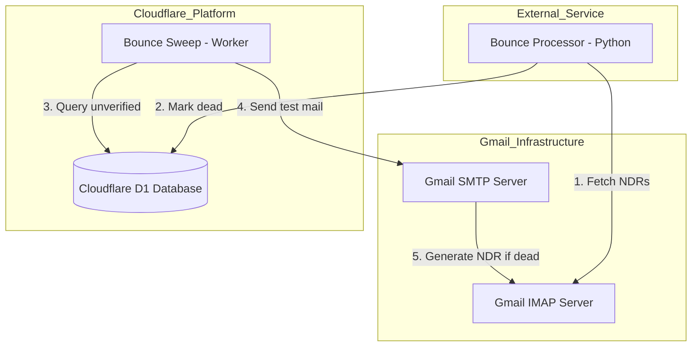
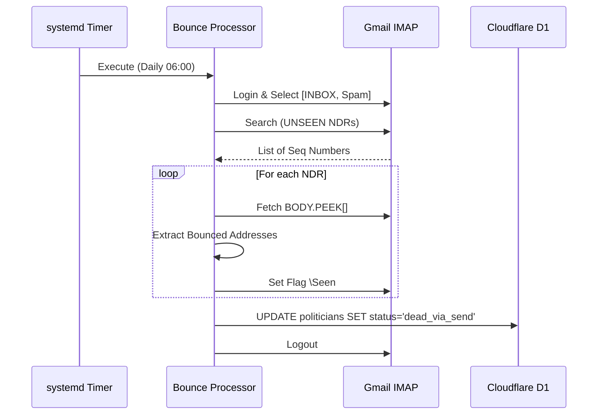

<details>
<summary>Relevant source files</summary>

The following files were used as context for generating this wiki page:

- [infra/bounce-processor.py](infra/bounce-processor.py)
- [campaign/src/bounce-sweep.ts](campaign/src/bounce-sweep.ts)
- [infra/schema.sql](infra/schema.sql)
- [infra/setup.sh](infra/setup.sh)
- [README.md](README.md)
- [campaign/src/quarterly-campaign.ts](campaign/src/quarterly-campaign.ts)
</details>

# Gmail Bounce Processing

Gmail Bounce Processing is a specialized subsystem designed to maintain the integrity of the politician contact database by identifying and handling undeliverable email addresses. The system consists of two primary components: a Python-based **Bounce Processor** that scans for Non-Delivery Reports (NDRs) via IMAP, and a TypeScript-based **Bounce Sweep** worker that proactively validates politician addresses that have not been contacted recently.

This system ensures that the platform avoids sending emails to "dead" addresses, which preserves the sender's reputation and improves overall delivery rates for citizen communications.
Sources: [README.md:54-55](README.md#L54-L55), [infra/bounce-processor.py:1-6](infra/bounce-processor.py#L1-L6), [campaign/src/bounce-sweep.ts:68-71](campaign/src/bounce-sweep.ts#L68-L71)

## System Architecture

The bounce processing architecture is split between an external Python service and internal Cloudflare Workers. The Python service interacts with the Gmail IMAP server to detect bounces, while the Cloudflare Workers manage the database state and proactive verification.



The diagram shows the lifecycle of a bounce, from identification by the external processor to proactive verification by the sweep worker.
Sources: [infra/bounce-processor.py:126-150](infra/bounce-processor.py#L126-L150), [campaign/src/bounce-sweep.ts:77-84](campaign/src/bounce-sweep.ts#L77-L84), [infra/setup.sh:163-176](infra/setup.sh#L163-L176)

## Bounce Processor (Python Service)

The `bounce-processor.py` script acts as a systemd-timer service that monitors a specific Gmail account for delivery failure notifications. It uses IMAP to search for unread messages with subjects like "Undeliverable" or "Delivery Status Notification".

### Address Extraction Logic
The processor employs multiple Regex patterns to identify bounced email addresses within the raw email body, covering various NDR formats including DSN-headers (RFC 3464), Postfix, and Microsoft NDRs.
Sources: [infra/bounce-processor.py:53-85](infra/bounce-processor.py#L53-L85)

| Pattern Source | Regex Example / Description |
| :--- | :--- |
| DSN-headers | `(Final-Recipient\|Original-Recipient)[^\n]*?<?([\w.+%-]+@[\w.\-]+\.\w+)>?` |
| Postfix | `<([\w.+%-]+@[\w.\-]+\.\w+)>\s*(?::\s*\n\|\s*\()` |
| Microsoft NDR | `failed to these recipients[^\n]*\n\s*\n?\s*([\w.+%-]+@[\w.\-]+\.\w+)` |
| Exchange/O365 | `Recipient Address:\s*([\w.+%-]+@[\w.\-]+\.\w+)` |

Sources: [infra/bounce-processor.py:57-81](infra/bounce-processor.py#L57-L81)

### Filtering and Verification
Before marking an address as dead, the system filters out common domains and system addresses to avoid false positives. It skips domains like `gmail.com`, `outlook.com`, and `apple.com`, and ignores patterns such as `mailer-daemon@` or `postmaster@`.
Sources: [infra/bounce-processor.py:32-49](infra/bounce-processor.py#L32-L49)

### Database Update
Addresses identified as bounced are updated in the Cloudflare D1 `politicians` table. The `verification_status` is set to `dead_via_send` and the `last_verified_at` timestamp is updated.
Sources: [infra/bounce-processor.py:88-109](infra/bounce-processor.py#L88-L109), [infra/schema.sql:63-65](infra/schema.sql#L63-L65)

## Proactive Bounce Sweep

The `bounce-sweep.ts` module is a cron-driven worker within the campaign system. Its purpose is to proactively contact municipal politicians (`area_type='kommun'`) who have not been reached within the last 90 days.

### Verification Workflow
1.  **Selection**: Queries the D1 database for politicians who are not marked as `dead_via_send` and have no record in `campaign_recipients` within the last 90 days.
2.  **Letter Generation**: Uses Anthropic's Claude Haiku model to generate a short, personalized citizen letter regarding local issues.
3.  **Transmission**: Sends the letter via Gmail SMTP.
4.  **Logging**: Records the attempt in `civic_letter_drafts` and `campaign_recipients` with a status of 'sent'.
Sources: [campaign/src/bounce-sweep.ts:47-84](campaign/src/bounce-sweep.ts#L47-L84)

### Sweep Parameters
| Parameter | Value | Description |
| :--- | :--- | :--- |
| `MAX_PER_RUN` | 150 | Maximum politicians contacted per execution. |
| `SWEEP_DAYS` | 90 | Time window to consider a politician "not recently contacted". |
| `Model` | `ANTHROPIC_HAIKU` | AI model used for sweep letter generation. |
| `Target Type` | `kommun` | Target area type for sweep operations. |

Sources: [campaign/src/bounce-sweep.ts:6-7](campaign/src/bounce-sweep.ts#L6-L7), [campaign/src/bounce-sweep.ts:50-51](campaign/src/bounce-sweep.ts#L50-L51), [campaign/src/bounce-sweep.ts:25](campaign/src/bounce-sweep.ts#L25)

## Database Schema for Bounce Tracking

The system relies on specific fields in the `politicians` table and tracking in campaign logs to manage address health.

```sql
CREATE TABLE politicians (
  id TEXT PRIMARY KEY,
  name TEXT NOT NULL,
  email TEXT NOT NULL,
  area_name TEXT NOT NULL,
  area_type TEXT NOT NULL,
  verification_status TEXT NOT NULL DEFAULT 'unknown', -- 'dead_via_send' indicates a bounce
  last_verified_at INTEGER,
  UNIQUE(email, area_name)
);

CREATE TABLE campaign_recipients (
  id TEXT PRIMARY KEY,
  draft_id TEXT NOT NULL REFERENCES civic_letter_drafts(id),
  politician_id TEXT NOT NULL REFERENCES politicians(id),
  politician_email TEXT NOT NULL,
  status TEXT NOT NULL, -- e.g., 'sent', 'failed'
  sent_at INTEGER,
  error TEXT
);
```

Sources: [infra/schema.sql:54-68](infra/schema.sql#L54-L68), [infra/schema.sql:102-111](infra/schema.sql#L102-L111)

## Deployment and Automation

The bounce processing system is deployed and managed via `infra/setup.sh`. This script installs the `bounce-processor` as a systemd timer on Linux environments, ensuring it runs daily at 06:00.

### Configuration Requirements
For the system to operate, the following credentials must be provided in `~/.claude/credentials.env`:
- `CLOUDFLARE_API_TOKEN_POLITIKER`: For updating the D1 database.
- `GMAIL_EMAIL`: The account monitored for bounces.
- `GMAIL_PASSWORD`: App password for IMAP and SMTP access.
Sources: [infra/setup.sh:34-45](infra/setup.sh#L34-L45), [infra/bounce-processor.py:113-120](infra/bounce-processor.py#L113-L120)

### Logic Flow for Sequence Processing



The sequence diagram illustrates the automated daily flow of identifying and processing NDRs.
Sources: [infra/bounce-processor.py:126-150](infra/bounce-processor.py#L126-L150), [infra/setup.sh:163-176](infra/setup.sh#L163-L176)

Gmail Bounce Processing provides a critical feedback loop, transforming email delivery failures into actionable database updates, thereby ensuring the longevity and reliability of the platform's contact data.
Sources: [README.md:54-55](README.md#L54-L55), [campaign/src/quarterly-campaign.ts:89-94](campaign/src/quarterly-campaign.ts#L89-L94)
