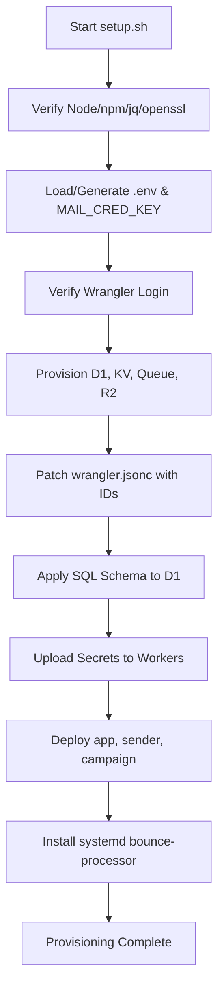

<details>
<summary>Relevant source files</summary>

The following files were used as context for generating this wiki page:

- [infra/setup.sh](infra/setup.sh)
- [infra/cf-api.sh](infra/az-graph-api.sh)
- [infra/az-graph-api.sh](infra/az-graph-api.sh)
- [README.md](README.md)
- [infra/schema.sql](infra/schema.sql)
- [infra/healthcheck.py](infra/healthcheck.py)
- [AGENTS.md](AGENTS.md)
</details>

# Cloudflare Infrastructure Provisioning

The provisioning system for the Politiker-webapp is designed to automate the deployment of a serverless architecture entirely within the Cloudflare ecosystem. It leverages a combination of Cloudflare Workers, D1 (SQL database), KV (Key-Value storage), Queues (asynchronous processing), and R2 (Object storage) to provide a scalable platform for citizens to contact elected officials.

The primary entry point for infrastructure management is the `infra/setup.sh` script, which handles resource creation, configuration patching, and deployment of the application's three core Workers: `app`, `sender`, and `campaign`.

Sources: [README.md:92-108](README.md#L92-L108), [infra/setup.sh:1-15](infra/setup.sh#L1-L15)

## Provisioning Workflow

The provisioning process is idempotent, allowing it to be run multiple times to update the deployment or secrets without disrupting existing data. It follows a structured sequence from dependency verification to the final deployment of worker scripts and systemd services for background processing.



The diagram shows the sequential steps taken by the automation script to ensure all Cloudflare resources and local configurations are aligned. 
Sources: [infra/setup.sh:42-167](infra/setup.sh#L42-L167)

## Cloudflare Resources

The infrastructure is composed of several managed Cloudflare services. The provisioning script identifies existing resources by name or creates them if they are missing.

### Managed Storage and Messaging
| Resource | Purpose | Name/Title |
| :--- | :--- | :--- |
| **D1 Database** | Relational storage for accounts, logs, and politician data | `politiker_webapp` |
| **KV Namespace** | High-speed storage for user sessions | `politiker_webapp_sessions` |
| **Queues** | Asynchronous queue for mail sending jobs | `politiker-send-jobs` |
| **R2 Bucket** | Object storage for mail attachments | `politiker-webapp-attachments` |

Sources: [infra/setup.sh:22-27](infra/setup.sh#L22-L27), [infra/setup.sh:100-128](infra/setup.sh#L100-L128)

### Database Schema Initialization
When a new D1 database is created, the script automatically applies the `infra/schema.sql` file. This schema defines the foundational tables for the application, including `accounts`, `politicians`, `send_jobs`, and `mail_credentials`.

```sql
-- Example of core infrastructure tables
CREATE TABLE accounts (
  id TEXT PRIMARY KEY,
  email TEXT UNIQUE NOT NULL,
  password_hash TEXT NOT NULL,
  is_admin INTEGER NOT NULL DEFAULT 0,
  created_at INTEGER NOT NULL
);

CREATE TABLE mail_credentials (
  id TEXT PRIMARY KEY,
  account_id TEXT NOT NULL REFERENCES accounts(id),
  provider TEXT NOT NULL,
  encrypted_password TEXT NOT NULL,
  daily_cap INTEGER,
  created_at INTEGER NOT NULL
);
```

Sources: [infra/schema.sql:3-16](infra/schema.sql#L3-L16), [infra/schema.sql:36-54](infra/schema.sql#L36-L54), [infra/setup.sh:140-145](infra/setup.sh#L140-L145)

## Worker Configuration and Secrets

The provisioning script dynamically patches `wrangler.jsonc` files for each worker module. This ensures that the generated resource IDs (UUIDs for D1 and KV) are correctly mapped to the application code before deployment.

### Secret Management
Security is maintained by injecting environment variables as Cloudflare Worker secrets. The `MAIL_CRED_KEY`, a 32-byte AES key used to encrypt SMTP credentials, is generated during the first run and must be identical across the `app` and `sender` workers to allow successful decryption during the sending process.

| Secret Name | Worker Target | Description |
| :--- | :--- | :--- |
| `MAIL_CRED_KEY` | `app`, `sender` | AES-GCM key for SMTP password encryption |
| `SYSTEM_SMTP_PASSWORD` | `app` | Password for system notifications/verification mail |
| `GITHUB_FEEDBACK_TOKEN` | `app`, `campaign` | PAT for creating GitHub issues for feedback/errors |
| `ANTHROPIC_API_KEY` | `campaign` | Key for Claude AI used in autonomous news research |

Sources: [infra/setup.sh:73-89](infra/setup.sh#L73-L89), [infra/setup.sh:152-177](infra/setup.sh#L152-L177), [AGENTS.md:27-30](AGENTS.md#L27-L30)

## Health Monitoring and Maintenance

Infrastructure health is monitored via a Python-based healthcheck script located at `infra/healthcheck.py`. This script performs deep diagnostics beyond simple HTTP pings, specifically looking for common Cloudflare configuration errors encountered during development.

### Monitoring Checks
1.  **Public Reachability**: Validates that the custom domain returns a 200 OK status.
2.  **Worker Existence**: Verifies that `app` and `sender` scripts are present in the Cloudflare account.
3.  **D1 Connectivity**: Executes a sample query against the `politicians` table.
4.  **Queue Stalls**: Checks for `send_jobs` stuck in `pending` or `sending` states for over 24 hours.
5.  **Access Diagnostics**: Checks if Cloudflare Access policies or Worker Domain mappings are misconfigured (e.g., missing bypass policies for public traffic).

Sources: [infra/healthcheck.py:46-105](infra/healthcheck.py#L46-L105)

## Summary
The provisioning system enables a "single command" deployment of a complex serverless application. By automating the lifecycle of D1 databases, R2 buckets, and Worker secrets, the project ensures environment consistency and reduces the barrier to entry for self-hosting. Maintenance is further supported by dedicated healthcheck logic that understands the specific pitfalls of the Cloudflare Workers runtime.

Sources: [README.md:92-95](README.md#L92-L95), [infra/setup.sh:186-193](infra/setup.sh#L186-L193)
