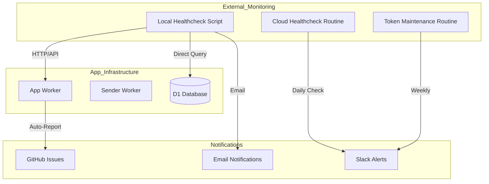
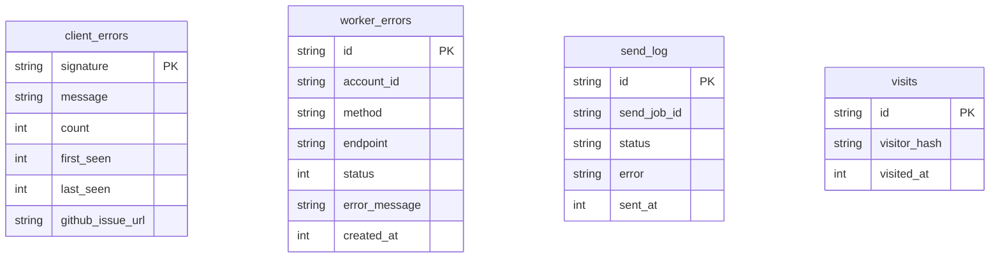

<details>
<summary>Relevant source files</summary>

The following files were used as context for generating this wiki page:

- [infra/healthcheck.py](infra/healthcheck.py)
- [README.md](README.md)
- [app/public/app.js](app/public/app.js)
- [infra/setup.sh](infra/setup.sh)
- [infra/schema.sql](infra/schema.sql)
- [app/src/admin-stats.ts](app/src/admin-stats.ts)
- [campaign/src/monitor.ts](campaign/src/monitor.ts)
</details>

# Healthchecks & Uptime Monitoring

The Healthchecks & Uptime Monitoring system in the Politiker-webapp project ensures high availability and operational integrity of the application. It consists of three independent layers: local cron-based checks on the operator's server, cloud-based monitoring routines, and automated client-side error reporting. These components collectively track HTTP availability, database connectivity, Cloudflare Worker status, and mail delivery performance.

Sources: [README.md:144-152](README.md#L144-L152), [infra/healthcheck.py:1-12](infra/healthcheck.py#L1-L12)

## System Architecture

The monitoring infrastructure is designed to be resilient by using multiple independent vantage points. This prevents a failure in one monitoring routine from blinding the operator to issues in the application itself.



The diagram shows the relationship between the various monitoring scripts and the application's infrastructure.
Sources: [README.md:144-152](README.md#L144-L152), [infra/healthcheck.py:53-110](infra/healthcheck.py#L53-L110), [app/public/app.js:45-60](app/public/app.js#L45-L60)

## Monitoring Components

### Local Healthcheck Script
A Python-based utility, `infra/healthcheck.py`, runs daily on a local server. It has full read access to the Cloudflare D1 database and validates the existence of critical Cloudflare Workers. 

The script performs the following specific checks:
*  **Public HTTP Response:** Validates that `https://politiker.denied.se/` and `/api/me` return a status code of 200.
*  **Worker Existence:** Checks the Cloudflare API to ensure both `politiker-webapp-app` and `politiker-webapp-sender` scripts are present.
*  **D1 Connectivity:** Executes a SQL query (`SELECT COUNT(*) FROM politicians`) to verify database reachability and data integrity.
*  **Stuck Jobs:** Scans the `send_jobs` table for entries stuck in 'pending' or 'sending' states for more than 24 hours.

Sources: [infra/healthcheck.py:53-95](infra/healthcheck.py#L53-L95), [README.md:146-147](README.md#L146-L147)

### Automated Client Error Reporting
The frontend application includes a self-monitoring mechanism that captures unexpected JavaScript exceptions and reports them directly as GitHub issues.

| Feature | Description | File Reference |
| :--- | :--- | :--- |
| **Deduplication** | Signatures are created from message and stack trace to prevent spam. | `app/public/app.js:52-53` |
| **External Filtering** | Ignores errors originating from browser extensions or Safari web extensions. | `app/public/app.js:65-70` |
| **Context Inclusion** | Reports include the URL, stack trace, and recent API call history. | `app/public/app.js:100-112`, `app/public/app.js:463-470` |
| **Rate Limiting** | Server-side protection includes a daily cap on issue creation. | `app/public/app.js:49-50` |

Sources: [app/public/app.js:45-84](app/public/app.js#L45-L84), [README.md:46-47](README.md#L46-L47)

### Cloud Monitoring & Maintenance
The project utilizes two additional cloud-based routines:
*  **`politiker-webapp-cloud-healthcheck`:** A daily routine that posts status updates to Slack. Unlike the local script, it has restricted read-only permissions.
*  **`politiker-webapp-token-maintenance`:** A weekly routine that automatically renews Cloudflare API tokens and monitors the expiration of the GitHub feedback token.

Sources: [README.md:144-152](README.md#L144-L152)

## Data Logging and Schema

The monitoring and healthcheck systems rely on several specialized tables within the Cloudflare D1 database to track errors and operational status.



The ER diagram illustrates the tables used for logging errors and tracking system usage.
Sources: [infra/schema.sql:127-145](infra/schema.sql#L127-L145), [infra/schema.sql:159-170](infra/schema.sql#L159-L170)

### Error Tables
| Table | Purpose |
| :--- | :--- |
| `worker_errors` | Logs 4xx/5xx server errors per API call, cleared every 48 hours. |
| `client_errors` | Stores unique signatures of JavaScript exceptions caught in the browser. |
| `send_log` | Tracks the success or failure (bounce) of every individual email sent. |

Sources: [infra/schema.sql:127-145](infra/schema.sql#L127-L145), [infra/schema.sql:109-118](infra/schema.sql#L109-L118)

## Diagnostics and Remediation

The `healthcheck.py` script includes diagnostic logic to identify common infrastructure failures encountered during development, such as:
1.  **Custom Domain Mismatch:** Verifies if the custom domain points to the correct Worker service.
2.  **Access Policy Failures:** Checks for the existence of Cloudflare Access applications and ensures a "bypass" policy is active for public traffic.

Sources: [infra/healthcheck.py:97-118](infra/healthcheck.py#L97-L118)

```python
# Diagnostic logic for common Cloudflare configuration issues
try:
    domain_resp = cf_get(token, f"/accounts/{ACCOUNT_ID}/workers/domains?domain={DOMAIN}")
    domains = domain_resp.get("result", [])
    if domains and domains[0].get("service") != APP_WORKER:
        problems.append(f"DIAGNOS: Custom domain {DOMAIN} pekar mot '{domains[0].get('service')}'")
except Exception:
    pass
```

Sources: [infra/healthcheck.py:98-106](infra/healthcheck.py#L98-L106)

## Summary

The Healthchecks & Uptime Monitoring system provides a multi-layered defense against downtime. By combining local script execution for deep infrastructure inspection, cloud routines for redundant alerting, and proactive client-side error reporting, the system ensures that developers are notified of failures—from database disconnects to front-end bugs—before they impact a significant number of users. This architecture is vital for maintaining the "autonomous" nature of the application's campaign and newsletter functions.

Sources: [README.md:46-52](README.md#L46-L52), [README.md:144-152](README.md#L144-L152), [infra/healthcheck.py:1-12](infra/healthcheck.py#L1-L12)
