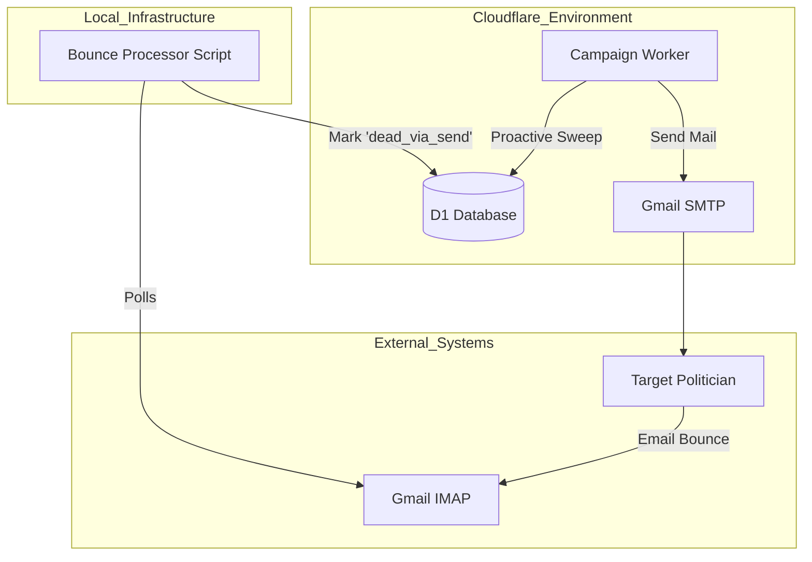
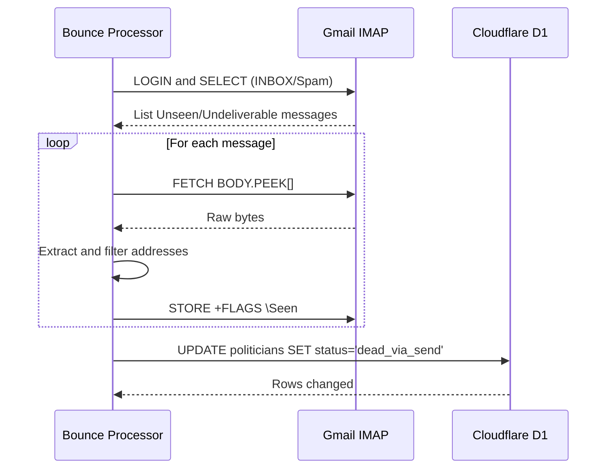

<details>
<summary>Relevant source files</summary>

The following files were used as context for generating this wiki page:

- [infra/bounce-processor.py](infra/bounce-processor.py)
- [campaign/src/bounce-sweep.ts](campaign/src/bounce-sweep.ts)
- [README.md](README.md)
- [infra/setup.sh](infra/setup.sh)
- [app/src/admin-stats.ts](app/src/admin-stats.ts)
- [app/public/app.js](app/public/app.js)
</details>

# Bounce Processing

Bounce Processing in the `politiker-webapp` project is a multi-layered system designed to maintain the integrity of the politician contact database by identifying and neutralizing invalid email addresses. It ensures that delivery failures (bounces) are detected, recorded, and used to prevent future wasted resources. This is critical for the "autonom kampanj-Worker" which operates without human intervention.

The system consists of two primary mechanisms: proactive "sweeping" of contacts that have not been reached recently to verify their status, and reactive processing of Delivery Status Notifications (DSNs) received in the system's Gmail account.

Sources: [README.md:38-40](README.md#L38-L40), [campaign/src/bounce-sweep.ts:63-65](campaign/src/bounce-sweep.ts#L63-L65)

## System Architecture

The bounce processing logic is split between a Python-based background service and a TypeScript-based Cloudflare Worker.

*  **Bounce Processor (Python):** A systemd-timer driven script that monitors the IMAP inbox of the sender's Gmail account to parse bounce notifications.
*  **Bounce Sweep (TypeScript):** Part of the autonomous campaign worker that proactively targets "kommun" (municipality) politicians who haven't been contacted within a specific timeframe (default 90 days).

The following diagram illustrates the interaction between these components and the central D1 database.



Sources: [infra/bounce-processor.py:7-12](infra/bounce-processor.py#L7-L12), [campaign/src/bounce-sweep.ts:1-2](campaign/src/bounce-sweep.ts#L1-L2), [infra/setup.sh:162-174](infra/setup.sh#L162-L174)

## Proactive: Bounce Sweep

The `bounce-sweep` module is a preventive measure to ensure the politician database remains fresh. It identifies municipality politicians who have not been included in a campaign for the last 90 days and attempts to send them a generic "medborgarbrev" (citizen letter) generated by AI.

### Logic Flow
1.  **Identify Targets:** Query the database for politicians where `area_type='kommun'` and `verification_status` is not already `dead_via_send`.
2.  **Filter by Recency:** Ensure they haven't been sent a message in the last 90 days.
3.  **Generate Content:** Use Anthropic Claude (Haiku model) to generate a short, realistic citizen letter.
4.  **Send and Log:** Send the email via SMTP and record the attempt in `campaign_recipients` and `civic_letter_drafts`.

Sources: [campaign/src/bounce-sweep.ts:13-56](campaign/src/bounce-sweep.ts#L13-L56)

### Key Sweep Parameters
| Parameter | Value | Description |
| :--- | :--- | :--- |
| `MAX_PER_RUN` | 150 | Maximum politicians contacted per execution. |
| `SWEEP_DAYS` | 90 | Time threshold for considering a contact "stale". |
| `Model` | ANTHROPIC_HAIKU | AI model used for generating verification letters. |

Sources: [campaign/src/bounce-sweep.ts:5-6](campaign/src/bounce-sweep.ts#L5-L6), [campaign/src/bounce-sweep.ts:25](campaign/src/bounce-sweep.ts#L25)

## Reactive: Bounce Processor Service

The `bounce-processor.py` script acts as the reactive component of the system. It periodically scans the `INBOX` and `[Gmail]/Spam` folders for undeliverable notifications.

### Address Extraction Logic
The processor uses regex patterns to identify bounced addresses within raw email bytes, specifically looking for:
*  DSN Headers (RFC 3464): `Final-Recipient` or `Original-Recipient`.
*  Postfix-style failures.
*  Standard phrases like "The following address(es) failed".
*  Microsoft NDR (Non-Delivery Report) patterns.

```python
# Example of address extraction patterns used in infra/bounce-processor.py
# Sources: [infra/bounce-processor.py:53-76]
for addr in re.findall(
    r"(?:Final-Recipient|Original-Recipient)[^\n]*?<?([\w.+%-]+@[\w.\-]+\.\w+)>?",
    full, re.I
):
    found.add(addr.lower())
```

### Filtering and Verification
To avoid false positives, the script filters extracted addresses against `SKIP_DOMAINS` (e.g., denied.se, icloud.com, google.com) and `SKIP_PATTERNS` (e.g., outlook outbound patterns or standard daemon addresses).

Sources: [infra/bounce-processor.py:31-48](infra/bounce-processor.py#L31-L48)

### Database Update Sequence
Once a valid politician email is identified as bounced, the processor executes a direct SQL update to the Cloudflare D1 database.



Sources: [infra/bounce-processor.py:100-145](infra/bounce-processor.py#L100-L145)

## Data Model and Status Tracking

Bounce processing directly impacts the `politicians` table and is reflected in the administrative dashboard.

### Politician Verification Status
| Status | Description |
| :--- | :--- |
| `dead_via_send` | The email address has been confirmed as a permanent bounce. |
| `(NULL)` | Default state; address is assumed valid until a bounce occurs. |

Sources: [infra/bounce-processor.py:84-86](infra/bounce-processor.py#L84-L86), [campaign/src/bounce-sweep.ts:60](campaign/src/bounce-sweep.ts#L60)

### Metrics and Monitoring
The administrative panel tracks bounce statistics to provide an overview of database health.
*  **Total Bounced:** Aggregated count of entries in the `send_log` with a `bounce` status.
*  **Last Verified:** The `last_verified_at` timestamp in the `politicians` table is updated whenever a bounce is processed.

Sources: [app/src/admin-stats.ts:16-20](app/src/admin-stats.ts#L16-L20), [infra/bounce-processor.py:86](infra/bounce-processor.py#L86), [app/public/app.js:636-640](app/public/app.js#L636-L640)

## Infrastructure Integration

The bounce processor is deployed as a `systemd` service and timer on the host machine. 

| File | Type | Purpose |
| :--- | :--- | :--- |
| `bounce-processor.service` | systemd Unit | Defines the execution of the Python script. |
| `bounce-processor.timer` | systemd Timer | Schedules the service to run daily (default 06:00). |
| `setup.sh` | Bash Script | Automates the installation and enabling of these units. |

Sources: [infra/setup.sh:162-174](infra/setup.sh#L162-L174), [infra/bounce-processor.py:10-12](infra/bounce-processor.py#L10-L12)

## Conclusion
The Bounce Processing system provides a closed-loop mechanism for ensuring high deliverability. By proactively testing municipality contacts through the `bounce-sweep` and reactively harvesting permanent failures via the `bounce-processor`, the application maintains an accurate database of politicians. This minimizes the risk of email provider blacklisting and ensures that citizen communication reaches active legislative targets.
