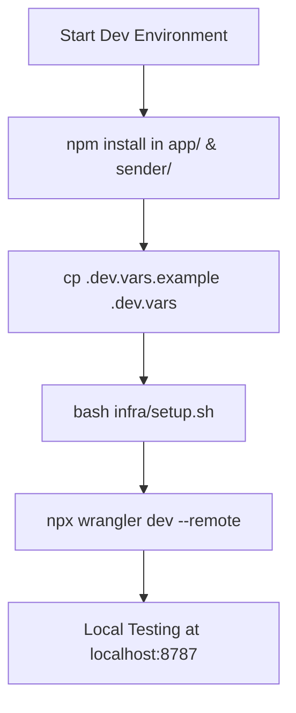
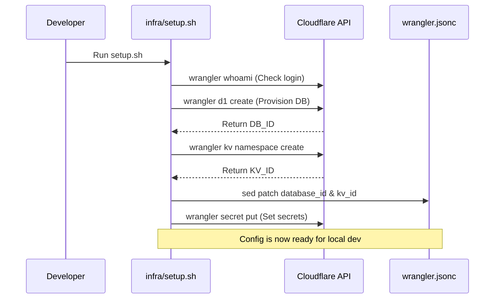

Relevant source files

The following files were used as context for generating this wiki page:

- [README.md](README.md)
- [AGENTS.md](AGENTS.md)
- [CLAUDE.md](CLAUDE.md)
- [app/package.json](app/package.json)
- [sender/package.json](sender/package.json)
- [campaign/package.json](campaign/package.json)
- [infra/setup.sh](infra/setup.sh)

# Local Development & Wrangler

Local development for the Politikerkontakt project is centered around the Cloudflare Workers ecosystem, utilizing **Wrangler** as the primary CLI tool for development, testing, and deployment. The architecture consists of multiple Workers (`app`, `sender`, and `campaign`) that interact with various Cloudflare services such as D1 (SQL database), KV (session storage), and Queues (asynchronous job processing).

The development environment is designed to be lightweight, using TypeScript and vanilla HTML/JS without heavy frontend frameworks. This ensures high performance within the Cloudflare Workers runtime while maintaining a clear separation of concerns between the static frontend/API, the mailing consumer, and autonomous campaign agents.

Sources: [README.md:120-135](README.md#L120-L135), [AGENTS.md:5-15](AGENTS.md#L5-L15), [CLAUDE.md:1-15](CLAUDE.md#L1-L15)

## Development Environment Setup

Setting up the local environment requires Node 18+ and a Cloudflare account. The project provides an automated provisioning script, `infra/setup.sh`, which handles the creation of necessary Cloudflare resources and patches configuration files with the resulting resource IDs.

### Prerequisites & Dependencies
Developers must have the following tools installed:
- **Node.js 18+** and **npm**
- **Wrangler** (managed via `npx` or installed globally)
- **OpenSSL** (for generating encryption keys)
- **jq** and **python3** (for infrastructure scripts)

Sources: [infra/setup.sh:16-43](infra/setup.sh#L16-L43), [README.md:150-160](README.md#L150-L160)

### Configuration Files
| File | Purpose |
| :--- | :--- |
| `.dev.vars` | Local environment variables for secrets (replaces `wrangler secret` locally) |
| `wrangler.jsonc` | Main configuration for Workers, including D1, KV, and Queue bindings |
| `~/.claude/credentials.env` | Centralized environment storage for the setup script |

Sources: [AGENTS.md:23-25](AGENTS.md#L23-L25), [infra/setup.sh:50-65](infra/setup.sh#L50-L65), [README.md:162-170](README.md#L162-L170)

## Local Execution with Wrangler

The project uses `wrangler dev --remote` to run the Workers. This command allows the local code to run against real Cloudflare resources (D1, KV) while providing a local development server for testing.

### Execution Workflow

The diagram shows the standard flow for initializing the development environment and starting the local server.
Sources: [AGENTS.md:23-28](AGENTS.md#L23-L28), [README.md:144-150](README.md#L144-L150)

### Core Development Commands
Common commands used during local development across the sub-projects:

- **Start Development Server:** `npx wrangler dev --remote` (Executed within `app/`, `sender/`, or `campaign/`)
- **Type Checking:** `npx tsc --noEmit`
- **Set Local Secrets:** Populate `.dev.vars` with keys like `MAIL_CRED_KEY`
- **Database Migrations:** `wrangler d1 execute <DB_NAME> --local --file=infra/schema.sql`

Sources: [app/package.json:5-15](app/package.json#L5-L15), [AGENTS.md:26-30](AGENTS.md#L26-L30), [CLAUDE.md:18-24](CLAUDE.md#L18-L24)

## Infrastructure Provisioning

The `infra/setup.sh` script automates the transition from a fresh clone to a functional development environment. It follows a specific logic to ensure all Cloudflare resource bindings are correct.

### Provisioning Logic

The sequence diagram illustrates how the setup script interacts with the Cloudflare CLI to provision resources and synchronize local configuration files.
Sources: [infra/setup.sh:85-150](infra/setup.sh#L85-L150), [README.md:173-195](README.md#L173-L195)

## Key Secrets and Security

In the local environment, security is maintained by mirroring the production secret structure using `.dev.vars`. The most critical secret is `MAIL_CRED_KEY`, an AES-256 key used to encrypt SMTP credentials before storing them in the D1 database.

### Mandatory Secrets
- **`MAIL_CRED_KEY`**: Must be identical in both `app/` and `sender/`. `app/` uses it to encrypt, while `sender/` uses it to decrypt for SMTP delivery.
- **`SYSTEM_SMTP_PASSWORD`**: Required for sending verification and notification emails.
- **`GITHUB_FEEDBACK_TOKEN`**: Used to create GitHub issues from client-side error reports.

Sources: [AGENTS.md:38-40](AGENTS.md#L38-L40), [SECURITY.md:13-18](SECURITY.md#L13-L18), [infra/setup.sh:65-80](infra/setup.sh#L65-L80)

## Deployment and CI/CD

Deployment is handled via Wrangler commands defined in the `package.json` of each Worker. The project also utilizes **Cloudflare Workers Builds** for automatic deployments upon pushes to the `main` branch.

### Deployment Commands
| Command | Action |
| :--- | :--- |
| `npm run deploy` | Executes `wrangler deploy --outdir dist` |
| `npm run versions:upload` | Uploads worker versions without immediate deployment |
| `npm run sentry:sourcemaps` | Uploads source maps to Sentry for error tracking |

Sources: [app/package.json:6-12](app/package.json#L6-L12), [sender/package.json:6-12](sender/package.json#L6-L12), [README.md:225-240](README.md#L225-L240)

### Error Tracking with Sentry
During deployment, source maps are uploaded to Sentry to provide readable stack traces. This requires `SENTRY_AUTH_TOKEN`, `SENTRY_ORG`, and `SENTRY_PROJECT` to be set as build-time environment variables in the Cloudflare Dashboard.

Sources: [README.md:245-265](README.md#L245-L265), [app/package.json:11-13](app/package.json#L11-L13)
