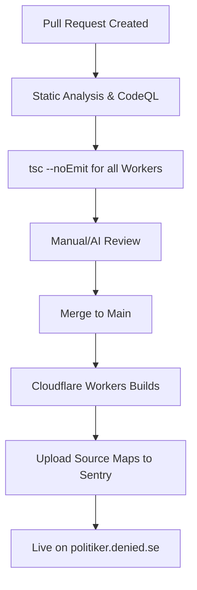
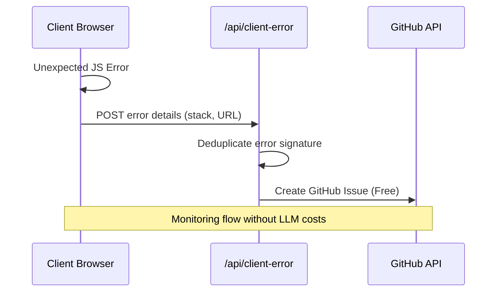

Relevant source files

The following files were used as context for generating this wiki page:

- [TODO.md](TODO.md)
- [README.md](README.md)
- [app/package.json](app/package.json)
- [sender/package.json](sender/package.json)
- [infra/ruleset-with-coderabbit.json](infra/ruleset-with-coderabbit.json)
- [infra/incident-claude-action-runaway.md](infra/incident-claude-action-runaway.md)
- [app/public/app.js](app/public/app.js)
- [AGENTS.md](AGENTS.md)

# Testing Strategy & CI/CD

The testing strategy and Continuous Integration/Continuous Deployment (CI/CD) pipeline for the **politiker-webapp** project focus on maintaining code quality through automated type-checking and manual verification, while transitioning toward a more robust automated testing suite. The project leverages Cloudflare Workers Builds for deployment and Sentry for real-time error monitoring across its distributed components (`app`, `sender`, and `campaign`).

Currently, the system relies heavily on TypeScript for static analysis and automated error reporting in the client to identify regressions. However, the roadmap prioritizes the addition of "real tests" to cover critical flows such as authentication, OAuth state management, and rate-limiting.

Sources: [TODO.md:3-8](TODO.md#L3-L8), [README.md:120-130](README.md#L120-L130), [AGENTS.md:58-69](AGENTS.md#L58-L69)

## Current CI Pipeline

The project utilizes GitHub branch protection rules to enforce code quality before merging into the `main` branch. The current CI checks are primarily focused on static analysis and type safety rather than functional unit or integration tests.

### Required Status Checks
For a Pull Request to be merged, it must pass several automated checks. These include language-specific analysis and environment-specific type checking.

| Check Context | Tool/Command | Description |
| :--- | :--- | :--- |
| `typecheck (app)` | `npx tsc --noEmit` | Validates TypeScript types in the main application worker. |
| `typecheck (sender)` | `npx tsc --noEmit` | Validates TypeScript types in the mail sender worker. |
| `Analyze (javascript-typescript)` | GitHub CodeQL/Analyze | Static security and quality analysis for JS/TS code. |
| `Analyze (python)` | GitHub CodeQL/Analyze | Static analysis for infrastructure scripts (e.g., healthchecks). |
| `CodeRabbit` | AI Review Tool | Automated AI code review (if enabled). |

Sources: [infra/ruleset-with-coderabbit.json:11-12](infra/ruleset-with-coderabbit.json#L11-L12), [TODO.md:4-6](TODO.md#L4-L6), [app/package.json:9](app/package.json#L9)

### CI Flow Diagram
The following diagram illustrates the lifecycle of a change from Pull Request to Deployment.

The CI process ensures that no code is merged without passing basic type validation, while the CD process automates the deployment and observability setup.
Sources: [infra/ruleset-with-coderabbit.json:1-12](infra/ruleset-with-coderabbit.json#L1-L12), [README.md:104-106](README.md#L104-L106), [README.md:120-125](README.md#L120-L125)

## Deployment & CD Strategy

The project utilizes **Cloudflare Workers Builds** for automated deployment. Pushing to the `main` branch triggers builds for the `app`, `sender`, and `campaign` workers.

### Source Map Integration
To ensure that error logs in production are actionable, the CI/CD pipeline includes a `postdeploy` hook to upload source maps to Sentry. This allows Sentry to translate minified JavaScript stack traces back into original TypeScript code.

- **Build-time Environment Variables**: `SENTRY_ORG`, `SENTRY_PROJECT`, and `SENTRY_AUTH_TOKEN` must be configured in the Cloudflare Dashboard as build-time variables.
- **Post-deployment Hook**: The command `npm run sentry:sourcemaps` is executed after successful deployment.

Sources: [README.md:120-140](README.md#L120-L140), [app/package.json:11-13](app/package.json#L11-L13), [campaign/package.json:11-13](campaign/package.json#L11-L13)

## Automated Monitoring & Error Reporting

In the absence of a comprehensive test suite, the project relies on a multi-layered monitoring strategy to detect failures in real-time.

### Client-Side Error Reporting
The frontend implements an `autoReportError()` function that captures unexpected JavaScript exceptions and unhandled promise rejections.

Client errors are automatically converted into GitHub issues for developer attention, with deduplication and daily rate-limiting to prevent spam.
Sources: [app/public/app.js:46-65](app/public/app.js#L46-L65), [TODO.md:32-35](TODO.md#L32-L35)

### Health Checks
Three independent monitoring routines oversee the production environment:
1. **Local Cron**: Runs on the operator's server with full write access.
2. **Cloud Healthcheck**: A daily routine (`politiker-webapp-cloud-healthcheck`) that posts status to Slack.
3. **Token Maintenance**: A weekly routine that rotates Cloudflare API tokens and warns about expiring GitHub tokens.

Sources: [README.md:164-173](README.md#L164-L173)

## Testing Roadmap & Technical Debt

The project documentation acknowledges that the current testing strategy is "too thin" for a system handling SMTP, OAuth, and sensitive credentials. The following improvements are prioritized in the `TODO.md`:

### High-Value Test Targets
- **Auth & Recovery**: Password reset and TOTP flows.
- **OAuth**: State management and callback handling.
- **Recipient Filtering**: Logic for normalising `role_key` and filtering politicians.
- **Rate Limiting**: Verifying the Durable Object implementation for `send-jobs`.

### Infrastructure Security
Security testing is currently manual, but the project follows strict conventions to prevent regression:
- PBKDF2 iterations are capped at **100,000** due to Cloudflare Worker runtime limits.
- `MAIL_CRED_KEY` must be identical across workers to ensure successful decryption of SMTP credentials.
- `socket.startTls()` must call `.releaseLock()` to avoid runtime upgrade errors.

Sources: [TODO.md:4-12](TODO.md#L4-L12), [AGENTS.md:39-48](AGENTS.md#L39-L48), [README.md:175-185](README.md#L175-L185)

## Conclusion

The project's current CI/CD strategy prioritizes deployment speed and runtime observability. While static typing via TypeScript provides a baseline for stability, the system relies on real-time error reporting to GitHub and Sentry to manage quality. The architecture is designed for a transition to formal integration testing, particularly for the complex async queue and SMTP logic handled by the `sender` worker.
Sources: [README.md:120-125](README.md#L120-L125), [TODO.md:46-48](TODO.md#L46-L48)
