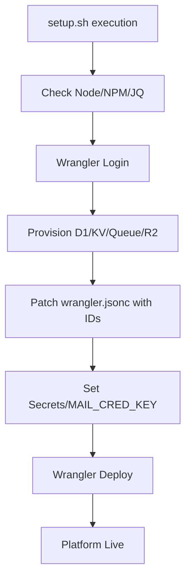
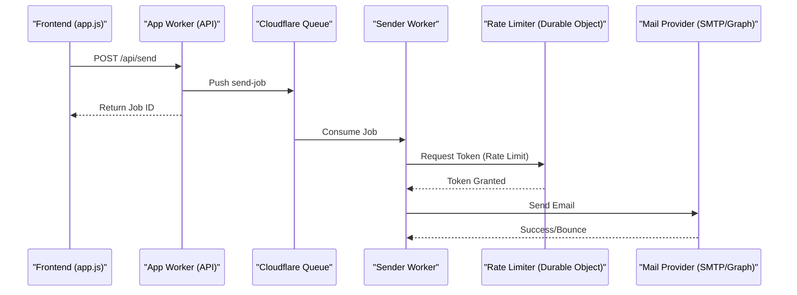

<details>
<summary>Relevant source files</summary>

The following files were used as context for generating this wiki page:

- [AGENTS.md](AGENTS.md)
- [CLAUDE.md](CLAUDE.md)
- [TODO.md](TODO.md)
- [README.md](README.md)
- [SECURITY.md](SECURITY.md)
- [infra/setup.sh](infra/setup.sh)
- [app/public/app.js](app/public/app.js)
</details>

# Extending the Platform & Contribution Guidelines

The politician-webapp platform is built as a lightweight, high-performance web tool designed to allow citizens to contact elected officials through their own email accounts. It utilizes a modern serverless architecture based on Cloudflare Workers, D1 (SQLite), and KV storage.

This guide provides technical instructions for developers and contributors looking to extend the platform's functionality, maintain its security standards, and adhere to the established project structure. It covers the technical stack, development workflows, and critical architectural constraints necessary for successful contributions.
Sources: [AGENTS.md:1-10](AGENTS.md#L1-L10), [README.md:1-15](README.md#L1-L15)

## Development Environment & Workflow

The project is structured as a monorepo containing multiple specialized Workers. Contributors must ensure they have Node 18+ and the Wrangler CLI installed for development and deployment.

### Project Structure
| Module | Description |
| :--- | :--- |
| `app/` | Main Worker: Handles static frontend, Auth, API, and admin logic. |
| `sender/` | Queue Consumer: Manages actual SMTP/Graph email transmission. |
| `campaign/` | Autonomous Worker: Cron-driven agent for news research and automated letters. |
| `shared/` | Shared Utilities: Encryption, SMTP clients, TOTP logic, and shared types. |
| `infra/` | Infrastructure: Shell scripts for provisioning, SQL schemas, and health checks. |

Sources: [AGENTS.md:19-24](AGENTS.md#L19-L24), [README.md:95-103](README.md#L95-L103)

### Essential Commands
Contributors should use the following commands within the respective module directories:

```bash
# Setup environment
cd app && npm install && cp .dev.vars.example .dev.vars
cd ../sender && npm install

# Start local development (remote mode for D1/KV access)
npx wrangler dev --remote

# Verify types
npx tsc --noEmit
```

Sources: [AGENTS.md:12-17](AGENTS.md#L12-L17), [CLAUDE.md:16-21](CLAUDE.md#L16-L21)

### Deployment Lifecycle
The deployment process uses `wrangler` and is often managed via a centralized setup script that provisions resources and sets secrets.



The `infra/setup.sh` script automates the creation of resources and ensures that `MAIL_CRED_KEY` is identical across workers for decryption.
Sources: [infra/setup.sh:1-150](infra/setup.sh#L1-L150), [AGENTS.md:26-30](AGENTS.md#L26-L30)

## Contribution Rules & Constraints

To maintain platform stability, contributors must adhere to specific technical and procedural rules.

### Allowed and Forbidden Actions
- **Allowed**: Create branches, modify code, run tests, and open Pull Requests.
- **Forbidden**: Pushing directly to `main`, merging your own PRs, deleting branches, or modifying secrets directly in the repository.
Sources: [AGENTS.md:36-47](AGENTS.md#L36-L47)

### Technical Constraints
1. **Cryptography**: Password hashing via PBKDF2 is limited to a maximum of **100,000 iterations** due to Cloudflare Workers runtime limits.
2. **Socket Handling**: When using `socket.startTls()`, the developer MUST call `.releaseLock()` on the writer and reader before the upgrade; calling `.close()` will cause an error.
3. **Data Isolation**: All database queries must filter on `account_id` to ensure strict account isolation, except for administrative endpoints which require `is_admin = 1`.
4. **Environment Variables**: Never hardcode credentials. Use `wrangler secret put` for sensitive values like `MAIL_CRED_KEY`.
Sources: [AGENTS.md:26-34](AGENTS.md#L26-L34), [SECURITY.md:12-18](SECURITY.md#L12-L18)

## System Architecture

The platform relies on an asynchronous flow for sending emails to avoid timeouts and manage rate limits per mail provider.

### Mail Delivery Flow
When a user sends a letter, the `app` Worker does not send the email directly. Instead, it queues a job.



The `Sender` Worker uses a Durable Object implementation of a token bucket to ensure rate limits are respected across parallel send tasks for the same account.
Sources: [README.md:58-62](README.md#L58-L62), [README.md:98-100](README.md#L98-L100), [app/public/app.js:636-670](app/public/app.js#L636-L670)

## Implementation Guidelines

### Extending the Frontend
The frontend is built with vanilla JavaScript and components. Significant logic resides in `app/public/app.js`, but new features should be broken down into domain-specific modules as suggested in the project roadmap.

**Key Frontend Considerations**:
- **Internationalization**: All text must use the `t()` function from `i18n.js`. New languages require a manual update or lazy-loading implementation.
- **Error Reporting**: Use `autoReportError(message, extra)` to log unexpected JS errors to the server, which then creates GitHub issues.
- **Theme Support**: Use `applyTheme(theme)` to toggle between "dark", "light", and "system" modes.
Sources: [TODO.md:16-25](TODO.md#L16-L25), [app/public/app.js:46-60](app/public/app.js#L46-L60), [app/public/app.js:18-30](app/public/app.js#L18-L30)

### Extending the API
API routes are currently centralized in `app/src/index.ts`. Extensions should follow these patterns:
- **Authentication**: Endpoints should verify session tokens stored in KV.
- **Admin Access**: Routes under `/api/admin/*` must be protected by an `is_admin` check.
- **Output Safety**: Use `escapeHtml()` for any server-side data rendered in the DOM to prevent XSS.
Sources: [TODO.md:27-32](TODO.md#L27-L32), [app/public/app.js:111-115](app/public/app.js#L111-L115)

## Security Policy

Vulnerability reporting should be conducted privately via GitHub's private reporting feature rather than through public issues.

| Component | Security Measure |
| :--- | :--- |
| **SMTP Passwords** | Encrypted with AES-GCM using `MAIL_CRED_KEY`. |
| **Account Passwords** | Hashed with PBKDF2 (max 100k iterations). |
| **API Access** | Supports `Authorization: Bearer <key>` for programmatic access. |
| **Input Validation** | Turnstile protection on signup, password reset, and newsletter forms. |

Sources: [SECURITY.md:1-20](SECURITY.md#L1-L20), [README.md:46-52](README.md#L46-L52), [app/public/app.js:231-240](app/public/app.js#L231-L240)

## Summary

Extending the politiker-webapp requires an understanding of Cloudflare's serverless ecosystem and a commitment to strict security and performance constraints (such as PBKDF2 limits and socket locking). Contributions should focus on modularizing the frontend, adding automated tests, and expanding the politician database. Developers must use the `infra/setup.sh` utility for consistent environment provisioning and ensure that all workers share the same encryption secrets.
Sources: [TODO.md:5-15](TODO.md#L5-L15), [infra/setup.sh:1-20](infra/setup.sh#L1-L20), [AGENTS.md:26-30](AGENTS.md#L26-L30)
