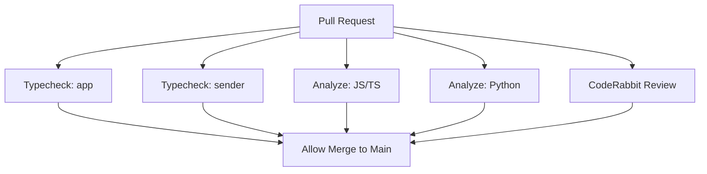
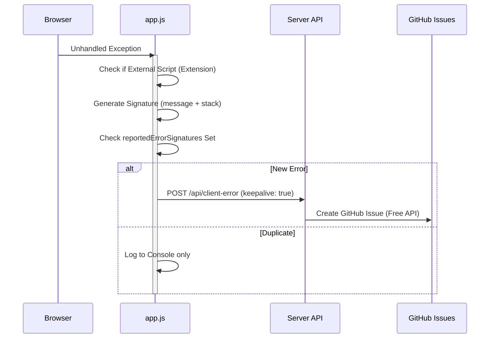

Relevant source files

The following files were used as context for generating this wiki page:

- [TODO.md](TODO.md)
- [README.md](README.md)
- [app/public/app.js](app/public/app.js)
- [AGENTS.md](AGENTS.md)
- [infra/ruleset-with-coderabbit.json](infra/ruleset-with-coderabbit.json)
- [app/package.json](app/package.json)

# Testing Strategy & Plans

The testing strategy for the `politiker-webapp` project currently emphasizes static analysis, automated monitoring, and proactive error reporting. While the project is in a phase of transitioning from basic validation to comprehensive automated testing, it relies heavily on Cloudflare Workers' runtime safety and real-time observability to ensure system stability.

Current continuous integration (CI) efforts focus on environment consistency and type safety across the distributed components: `app`, `sender`, and `campaign`. The roadmap identifies a critical need for high-value tests covering authentication, OAuth flows, and mail delivery logic to support a system handling sensitive SMTP credentials and multi-step wizard states.

Sources: [TODO.md:5-11](TODO.md#L5-L11), [README.md:104-106](README.md#L104-L106)

## CI/CD and Static Analysis

The primary automated defense mechanism in the current pipeline is static type checking. This ensures that the shared types and internal APIs between the main application and the mail sender worker remain synchronized.

### Automated Status Checks
The project employs GitHub repository rulesets to enforce quality gates on the `main` branch. Pull requests must pass several status checks before merging to prevent regressions in the production environment.

The diagram shows the parallel status checks required for pull requests.
Sources: [infra/ruleset-with-coderabbit.json:10-11](infra/ruleset-with-coderabbit.json#L10-L11), [AGENTS.md:52](AGENTS.md#L52), [app/package.json:10](app/package.json#L10)

### Validation Scripts
| Script | Command | Purpose |
| :--- | :--- | :--- |
| `typecheck` | `tsc --noEmit` | Validates TypeScript integrity without generating output files. |
| `Analyze` | (GitHub Action) | Performs static analysis for security and code quality (JS, Python, Actions). |
| `Secret Audit` | `wrangler secret` | Ensures required keys like `MAIL_CRED_KEY` are provisioned but not committed. |

Sources: [app/package.json:10](app/package.json#L10), [infra/ruleset-with-coderabbit.json:11](infra/ruleset-with-coderabbit.json#L11), [AGENTS.md:33](AGENTS.md#L33)

## Client-Side Error Monitoring

The application implements a multi-layered monitoring system to capture runtime exceptions that occur in the users' browsers. This replaces the deprecated autonomous issue-fixer with a more cost-effective reporting pipeline.

### Auto-Reporting Logic
The `autoReportError` function captures unexpected JavaScript exceptions and sends them to a dedicated API endpoint (`/api/client-error`). To prevent log spam and excessive API calls, the system utilizes a signature-based deduplication mechanism.

The diagram illustrates the flow from a client-side crash to a GitHub issue creation.
Sources: [app/public/app.js:40-75](app/public/app.js#L40-L75), [TODO.md:27-31](TODO.md#L27-L31)

### Diagnostic Context
When a feedback report or error is submitted, the system bundles significant context to assist in debugging:
*  **Recent API Calls:** A ring-buffer of the last 15 API interactions (excluding request bodies for security).
*  **Environment Data:** URL, User-Agent, and current navigation step (Wizard 1–3).
*  **Error Signatures:** Truncated stacks to identify unique bugs.

Sources: [app/public/app.js:103-116](app/public/app.js#L103-L116), [app/public/app.js:774-785](app/public/app.js#L774-L785)

## Production Health Checks

Outside of the application code, the infrastructure is monitored by independent routines to ensure high availability of the mail-sending pipeline and the D1 database.

| Monitor Type | Target | Frequency | Notification |
| :--- | :--- | :--- | :--- |
| **Local Cron** | Operator Server | Regular | Email |
| **Cloud Healthcheck** | Cloudflare Worker | Daily | Slack |
| **Token Maintenance** | API Permissions | Weekly | Slack |
| **Bounce Processor** | Gmail Bounces | Daily (06:00) | Systemd Logs |

Sources: [README.md:154-162](README.md#L154-L162), [README.md:144-149](README.md#L144-L149)

## Testing Roadmap

The project maintains a prioritized list of testing improvements to move beyond basic static analysis.

### High-Priority Test Suites
1.  **Authentication:** Validation of login, registration, and password reset flows.
2.  **OAuth Integration:** Verification of state management and callback handling for Google, GitHub, and Microsoft.
3.  **Recipient Filtering:** Logic tests for `role_key` normalization and area-based filtering to ensure accurate recipient counts.
4.  **Send Queue & Rate Limiting:** Verification of the Durable Object-based token bucket used for sharing send rates between workers.

Sources: [TODO.md:5-11](TODO.md#L5-L11), [TODO.md:33-38](TODO.md#L33-L38)

### Security Testing Constraints
The project enforces specific security requirements during testing and development:
*  **PBKDF2 Iterations:** Must not exceed 100,000 due to Cloudflare Worker runtime limitations.
*  **SMTP Socket Safety:** Testing must verify that `socket.startTls()` is preceded by `.releaseLock()` on readers and writers.
*  **Credential Isolation:** Verification that all database queries strictly filter by `account_id` to maintain multi-tenant isolation.

Sources: [AGENTS.md:38-42](AGENTS.md#L38-L42), [README.md:170-172](README.md#L170-L172)

## Conclusion
The current testing strategy relies on a combination of **static type checking** during development and **automated observability** in production. By leveraging Sentry, GitHub Issue automation, and independent health checks, the project maintains stability while working toward a more robust suite of automated unit and integration tests for its core business logic.

Sources: [README.md:133-138](README.md#L133-L138), [TODO.md:44-46](TODO.md#L44-L46)
